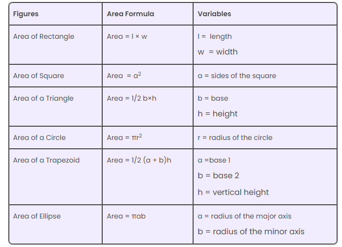

# Area and Perimeter Formula

- Area and Perimeter Formula are the two major formulas for any given two-dimensional shape in Mathematics. In geometry, you will come across many shapes such as circle, triangle, square, pentagon, octagon, etc. In real life as well, you will come across different types of objects having different shapes and sizes, which occupy some space in a place and their outline distance specifies the total length of the object.

* All the shapes have their own properties, based on their structure, sides and angles. The two main features are the area and perimeter. For example, the amount of paint required to paint a wall of rectangular shape is calculated by its area and to put the boundaries of the square field we have to calculate its perimeter to know the total length of the field.

- Every geometrical shape has its area and perimeter. There are different formulas for area and perimeter of every shape as it has a different measurement. So, let us learn the area and perimeter formulas for all shapes, here.

## Area and Perimeter Formula Chart

- Area Formulas for different geometrical figures:

